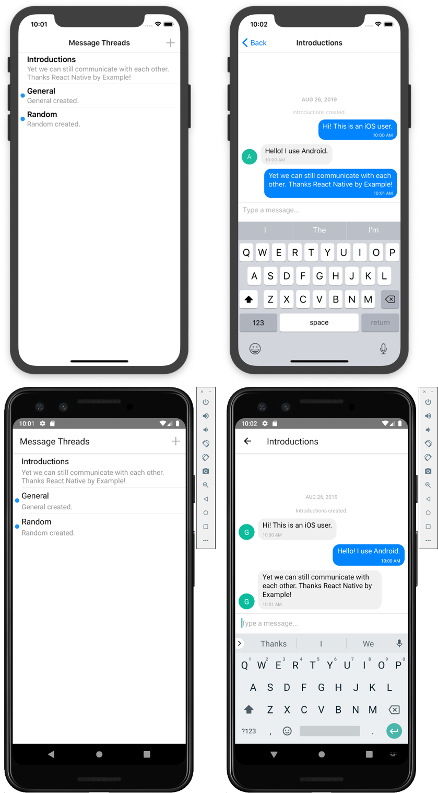

## React Native Firebase Chat App

### Installation

> **Note:** Be sure you have the React Native CLI [installed on your system](https://facebook.github.io/react-native/docs/getting-started).

- `git clone https://github.com/ReactNativeSchool/react-native-firebase-chat-app.git`
- `yarn install`/`npm install`
- `npx pod-install ios`

### Running

- `yarn run ios`/`npm run ios` or `yarn run android`/`npm run android`

---

